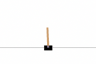
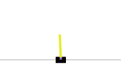
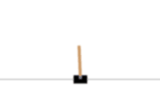
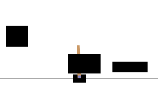
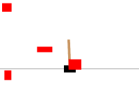
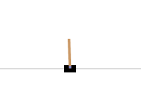
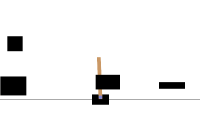
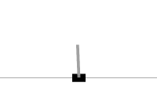
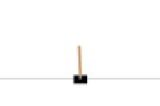

title: Wrapper
summary: Custom environment wrappers
---

::: stable_worldmodel.wrapper.MegaWrapper
    options:
        heading_level: 2
        members: false
        show_source: false

::: stable_worldmodel.wrapper.EnsureInfoKeysWrapper
    options:
        heading_level: 2
        members: false
        show_source: false

::: stable_worldmodel.wrapper.EnsureImageShape
    options:
        heading_level: 2
        members: false
        show_source: false

::: stable_worldmodel.wrapper.EnsureGoalInfoWrapper
    options:
        heading_level: 2
        members: false
        show_source: false

::: stable_worldmodel.wrapper.EverythingToInfoWrapper
    options:
        heading_level: 2
        members: false
        show_source: false

::: stable_worldmodel.wrapper.AddPixelsWrapper
    options:
        heading_level: 2
        members: false
        show_source: false


::: stable_worldmodel.wrapper.ResizeGoalWrapper
    options:
        heading_level: 2
        members: false
        show_source: false

## Visual Wrappers

Visual wrappers operate on rendered frames (the output of `env.render()` and any `info["pixels*"]` entries). They are useful for adding distractors at evaluation time or augmentations at training time.


::: stable_worldmodel.wrapper.ChromaKeyWrapper
    options:
        heading_level: 3
        members: false
        show_source: false



::: stable_worldmodel.wrapper.NoiseWrapper
    options:
        heading_level: 3
        members: false
        show_source: false



::: stable_worldmodel.wrapper.ColorJitterWrapper
    options:
        heading_level: 3
        members: false
        show_source: false



::: stable_worldmodel.wrapper.BlurWrapper
    options:
        heading_level: 3
        members: false
        show_source: false



::: stable_worldmodel.wrapper.OcclusionWrapper
    options:
        heading_level: 3
        members: false
        show_source: false



::: stable_worldmodel.wrapper.MovingPatchWrapper
    options:
        heading_level: 3
        members: false
        show_source: false



::: stable_worldmodel.wrapper.RandomShiftWrapper
    options:
        heading_level: 3
        members: false
        show_source: false



::: stable_worldmodel.wrapper.CutoutWrapper
    options:
        heading_level: 3
        members: false
        show_source: false


::: stable_worldmodel.wrapper.RandomConvWrapper
    options:
        heading_level: 3
        members: false
        show_source: false



::: stable_worldmodel.wrapper.GrayscaleWrapper
    options:
        heading_level: 3
        members: false
        show_source: false



::: stable_worldmodel.wrapper.ResolutionWrapper
    options:
        heading_level: 3
        members: false
        show_source: false

## Noise Schedules

Time-dependent schedules. Each function returns a callable `f(step) -> float` that can be passed to `NoiseWrapper(std=...)`. The wrapper increments `step` once per `env.step` call.

```python
from stable_worldmodel.wrapper import NoiseWrapper, linear

env = NoiseWrapper(env, std=linear(0, 25, horizon=10_000))
```

::: stable_worldmodel.wrapper.constant
    options:
        heading_level: 3
        show_source: false

::: stable_worldmodel.wrapper.linear
    options:
        heading_level: 3
        show_source: false

::: stable_worldmodel.wrapper.cosine
    options:
        heading_level: 3
        show_source: false

::: stable_worldmodel.wrapper.exponential
    options:
        heading_level: 3
        show_source: false

::: stable_worldmodel.wrapper.sinusoidal
    options:
        heading_level: 3
        show_source: false
