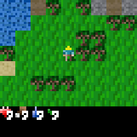
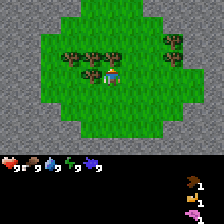

## Description

[Craftax](https://github.com/MichaelTMatthews/Craftax) is a reimplementation of [Crafter](https://github.com/danijar/crafter) — an open-ended 2D survival environment inspired by Minecraft. The agent navigates a procedurally generated world, gathers resources, crafts tools, fights enemies, and unlocks a hierarchy of achievements. The full **Craftax** version extends Crafter with floors, dungeons, magic, ranged combat, and additional creatures; **Craftax-Classic** is a faithful port of the original Crafter rules.

Both versions ship in a **Pixels** variant (rendered RGB tiles) and a **Symbolic** variant (flat feature vector). Episodes terminate on player death.

```python
import stable_worldmodel as swm

# Pixel-art observation — use 'nearest' resample to keep it crisp.
world = swm.World(
    'swm/CraftaxClassicPixels-v1',
    num_envs=4,
    image_shape=(224, 224),
    image_resample='nearest',
)

# Flat symbolic observation
world = swm.World('swm/CraftaxSymbolic-v1', num_envs=4, image_shape=(64, 64))
```

### Available Environments

| Environment | Environment ID | Observation | Actions |
|-------------|---------------|-------------|---------|
| [Craftax-Classic Pixels](#craftax-classic) | `swm/CraftaxClassicPixels-v1` | RGB `(63, 63, 3)` | `Discrete(17)` |
| [Craftax-Classic Symbolic](#craftax-classic) | `swm/CraftaxClassicSymbolic-v1` | Flat `(1345,)` | `Discrete(17)` |
| [Craftax Pixels](#craftax-full) | `swm/CraftaxPixels-v1` | RGB `(130, 110, 3)` | `Discrete(43)` |
| [Craftax Symbolic](#craftax-full) | `swm/CraftaxSymbolic-v1` | Flat `(8268,)` | `Discrete(43)` |

---

## Craftax-Classic



Faithful JAX port of the original Crafter benchmark: a single overworld map with 22 achievements (gather wood/stone/iron/diamond, craft pickaxes/swords, defeat zombies/skeletons, etc.). Player perception is a 9×7 tile window plus an inventory strip; observation is rendered at the agent's tile resolution.

```python
world = swm.World(
    'swm/CraftaxClassicPixels-v1',
    num_envs=4,
    image_shape=(224, 224),
    image_resample='nearest',
)
```

### Environment Specs

| Property | Value |
|----------|-------|
| Action Space | `Discrete(17)` — movement, place, craft, sleep, do |
| Observation Space (Pixels) | `Box(0, 1, shape=(63, 63, 3), float32)` |
| Observation Space (Symbolic) | `Box(0, 1, shape=(1345,), float32)` |
| Episode Termination | Player death |
| Auto-reset | Disabled (use `gym.wrappers.TimeLimit` to cap rollout length) |
| Environment ID | `swm/CraftaxClassicPixels-v1`, `swm/CraftaxClassicSymbolic-v1` |

### Info Dictionary

| Key | Description |
|-----|-------------|
| `Achievements/<name>` | 0/1 indicator per Crafter achievement (22 keys, e.g. `collect_wood`, `make_iron_pickaxe`) |
| `discount` | 0 if terminal, else 1 |
| `env_name` | Environment label |

---

## Craftax (Full)



The full version extends Crafter with multi-floor dungeons, ranged combat (bows, fireballs, iceballs), magic, and additional creatures. Observation includes a wider tile window and a richer inventory panel; the achievement set grows to 69+ entries.

```python
world = swm.World(
    'swm/CraftaxPixels-v1',
    num_envs=4,
    image_shape=(224, 224),
    image_resample='nearest',
)
```

### Environment Specs

| Property | Value |
|----------|-------|
| Action Space | `Discrete(43)` — movement, attack, cast, place, craft, level transitions |
| Observation Space (Pixels) | `Box(0, 1, shape=(130, 110, 3), float32)` |
| Observation Space (Symbolic) | `Box(0, 1, shape=(8268,), float32)` |
| Episode Termination | Player death |
| Auto-reset | Disabled (use `gym.wrappers.TimeLimit` to cap rollout length) |
| Environment ID | `swm/CraftaxPixels-v1`, `swm/CraftaxSymbolic-v1` |

### Info Dictionary

| Key | Description |
|-----|-------------|
| `Achievements/<name>` | 0/1 indicator per achievement (69+ keys, including `cast_fireball`, `cast_iceball`, dungeon traversal, ...) |
| `discount` | 0 if terminal, else 1 |
| `env_name` | Environment label |

## Tips

- For the **Pixels** variants, pass `image_resample='nearest'` to `swm.World` so pixel-art tiles stay crisp when upscaled — the default bilinear resampling blurs them.
- The wrapper does **not** distinguish `terminated` from `truncated`: every episode end is reported as `terminated=True`. Wrap with `gymnasium.wrappers.TimeLimit` if you need a step budget.
