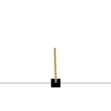
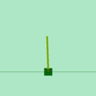
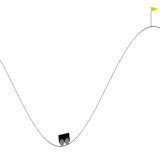
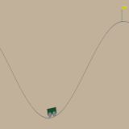
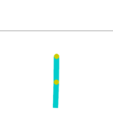
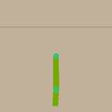
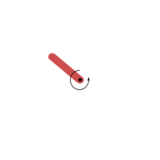
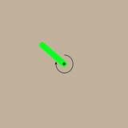

## Description

Wrappers around the standard [Gymnasium classic-control envs](https://gymnasium.farama.org/environments/classic_control/) (CartPole, MountainCar, Acrobot, Pendulum). Each wrapper exposes a `variation_space` so physics constants (gravity, masses, lengths, torques, ...) and rendered colors can be resampled at every reset.

```python
import stable_worldmodel as swm

# Default appearance and physics.
world = swm.World(
    'swm/CartPoleControl-v1',
    num_envs=4,
    image_shape=(256, 256),
    render_mode='rgb_array',
)

# Resample only specific factors.
world.reset(options={'variation': ['physics.gravity', 'visuals.cart']})
```

### Available Environments

| Environment | Environment ID | Action |
|-------------|----------------|--------|
| [CartPole](#cartpole) | `swm/CartPoleControl-v1` | Discrete(2) |
| [MountainCar](#mountaincar) | `swm/MountainCarControl-v0` | Discrete(3) |
| [MountainCarContinuous](#mountaincarcontinuous) | `swm/MountainCarContinuousControl-v0` | Box(-1, 1, shape=(1,)) |
| [Acrobot](#acrobot) | `swm/AcrobotControl-v1` | Discrete(3) |
| [Pendulum](#pendulum) | `swm/PendulumControl-v1` | Box(-2, 2, shape=(1,)) |

## Visual Variations

Colors are hardcoded inside the upstream Pygame `render()` calls, so visual factors are applied as a post-render RGB swap on the rendered frame. Each `visuals.*` factor maps a source RGB tuple in the upstream render to a target RGB sampled from the variation space. Bounds are tightened (light backgrounds, dark outlines, free RGB for accents) so foreground stays readable against background.

---

## CartPole



A pole is balanced on a cart that moves left or right. The default `length` is *half* the pole length.

**Task**: Keep the pole upright by pushing the cart.

```python
world = swm.World('swm/CartPoleControl-v1', num_envs=4, render_mode='rgb_array')
```

### Environment Specs

| Property | Value |
|----------|-------|
| Action Space | `Discrete(2)` — push left/right |
| Observation Space | `Box(shape=(4,))` — cart position, cart velocity, pole angle, pole angular velocity |
| Episode Length | 500 steps (gymnasium default) |
| Environment ID | `swm/CartPoleControl-v1` |
| Physics | Custom Python integrator |

### Variation Space

| Factor | Type | Description |
|--------|------|-------------|
| `physics.gravity` | Box(4.9, 14.7, shape=(1,)) | Gravity (m/s²) |
| `physics.masscart` | Box(0.5, 1.5, shape=(1,)) | Cart mass (kg) |
| `physics.masspole` | Box(0.05, 0.5, shape=(1,)) | Pole mass (kg) |
| `physics.length` | Box(0.25, 0.75, shape=(1,)) | Half-length of the pole (m) |
| `physics.force_mag` | Box(5.0, 15.0, shape=(1,)) | Magnitude of horizontal push |
| `physics.tau` | Box(0.01, 0.04, shape=(1,)) | Integration timestep (s) |
| `visuals.bg` | Box(0.6, 1.0, shape=(3,)) | Background RGB |
| `visuals.cart` | Box(0.0, 0.4, shape=(3,)) | Cart and track RGB |
| `visuals.pole` | Box(0.0, 1.0, shape=(3,)) | Pole RGB |
| `visuals.axle` | Box(0.0, 1.0, shape=(3,)) | Axle RGB |



---

## MountainCar



An under-powered car at the bottom of a valley must build momentum to climb the hill on the right.

**Task**: Reach the goal flag at the top of the right hill.

```python
world = swm.World('swm/MountainCarControl-v0', num_envs=4, render_mode='rgb_array')
```

### Environment Specs

| Property | Value |
|----------|-------|
| Action Space | `Discrete(3)` — push left, no-op, push right |
| Observation Space | `Box(shape=(2,))` — position, velocity |
| Episode Length | 200 steps (gymnasium default) |
| Environment ID | `swm/MountainCarControl-v0` |
| Physics | Custom Python integrator |

### Variation Space

| Factor | Type | Description |
|--------|------|-------------|
| `physics.gravity` | Box(0.00125, 0.00375, shape=(1,)) | Effective gravity coefficient |
| `physics.force` | Box(0.0005, 0.0015, shape=(1,)) | Action force coefficient |
| `physics.max_speed` | Box(0.035, 0.105, shape=(1,)) | Speed clamp |
| `visuals.bg` | Box(0.6, 1.0, shape=(3,)) | Background RGB |
| `visuals.fg` | Box(0.0, 0.4, shape=(3,)) | Mountain line / car / flagpole RGB |



---

## MountainCarContinuous

The continuous-action variant of MountainCar (renders identically to the discrete version above).

**Task**: Reach the flag with a continuous force in `[-1, 1]`.

```python
world = swm.World(
    'swm/MountainCarContinuousControl-v0',
    num_envs=4,
    render_mode='rgb_array',
)
```

### Environment Specs

| Property | Value |
|----------|-------|
| Action Space | `Box(-1, 1, shape=(1,))` — applied force |
| Observation Space | `Box(shape=(2,))` — position, velocity |
| Episode Length | 999 steps (gymnasium default) |
| Environment ID | `swm/MountainCarContinuousControl-v0` |
| Physics | Custom Python integrator |

### Variation Space

| Factor | Type | Description |
|--------|------|-------------|
| `physics.power` | Box(0.00075, 0.00225, shape=(1,)) | Action force scale |
| `physics.max_speed` | Box(0.035, 0.105, shape=(1,)) | Speed clamp |
| `visuals.bg` | Box(0.6, 1.0, shape=(3,)) | Background RGB |
| `visuals.fg` | Box(0.0, 0.4, shape=(3,)) | Mountain line / car / flagpole RGB |

> Gravity is hardcoded (`0.0025`) inside the upstream `step` function and is not exposed for variation.

---

## Acrobot



A two-link pendulum actuated only at the elbow joint must swing the tip above a target height.

**Task**: Swing the free tip above one link length above the base.

```python
world = swm.World('swm/AcrobotControl-v1', num_envs=4, render_mode='rgb_array')
```

### Environment Specs

| Property | Value |
|----------|-------|
| Action Space | `Discrete(3)` — −1, 0, +1 elbow torque |
| Observation Space | `Box(shape=(6,))` — sin/cos of joint angles, joint velocities |
| Episode Length | 500 steps (gymnasium default) |
| Environment ID | `swm/AcrobotControl-v1` |
| Physics | Custom Python integrator |

### Variation Space

| Factor | Type | Description |
|--------|------|-------------|
| `physics.link_length_1` | Box(0.5, 1.5, shape=(1,)) | Length of first link |
| `physics.link_length_2` | Box(0.5, 1.5, shape=(1,)) | Length of second link |
| `physics.link_mass_1` | Box(0.5, 1.5, shape=(1,)) | Mass of first link |
| `physics.link_mass_2` | Box(0.5, 1.5, shape=(1,)) | Mass of second link |
| `physics.link_com_pos_1` | Box(0.25, 0.75, shape=(1,)) | Center-of-mass offset, link 1 |
| `physics.link_com_pos_2` | Box(0.25, 0.75, shape=(1,)) | Center-of-mass offset, link 2 |
| `physics.link_moi` | Box(0.5, 1.5, shape=(1,)) | Link moment of inertia |
| `visuals.bg` | Box(0.6, 1.0, shape=(3,)) | Background RGB |
| `visuals.line` | Box(0.0, 0.4, shape=(3,)) | Skyline / outline RGB |
| `visuals.link` | Box(0.0, 1.0, shape=(3,)) | Link RGB |
| `visuals.joint` | Box(0.0, 1.0, shape=(3,)) | Joint marker RGB |



---

## Pendulum



A single rod hanging from a fixed pivot with a continuous torque actuator.

**Task**: Swing the rod up and balance it inverted.

```python
world = swm.World('swm/PendulumControl-v1', num_envs=4, render_mode='rgb_array')
```

### Environment Specs

| Property | Value |
|----------|-------|
| Action Space | `Box(-2, 2, shape=(1,))` — torque (clamped to `max_torque`) |
| Observation Space | `Box(shape=(3,))` — cos(θ), sin(θ), θ̇ |
| Episode Length | 200 steps (gymnasium default) |
| Environment ID | `swm/PendulumControl-v1` |
| Physics | Custom Python integrator |

### Variation Space

| Factor | Type | Description |
|--------|------|-------------|
| `physics.g` | Box(5.0, 15.0, shape=(1,)) | Gravity (m/s²) |
| `physics.m` | Box(0.5, 1.5, shape=(1,)) | Pendulum mass |
| `physics.l` | Box(0.5, 1.5, shape=(1,)) | Pendulum length |
| `physics.max_torque` | Box(1.0, 4.0, shape=(1,)) | Torque clip |
| `physics.max_speed` | Box(4.0, 12.0, shape=(1,)) | Angular-velocity clip |
| `physics.dt` | Box(0.025, 0.1, shape=(1,)) | Integration timestep (s) |
| `visuals.bg` | Box(0.6, 1.0, shape=(3,)) | Background RGB |
| `visuals.rod` | Box(0.0, 1.0, shape=(3,)) | Rod RGB |
| `visuals.hub` | Box(0.0, 0.4, shape=(3,)) | Pivot/hub RGB |

> `max_torque` and `max_speed` are read by Gymnasium when constructing `action_space` / `observation_space`. Values resampled after `gym.make` update the physics clipping but not the declared spaces.


